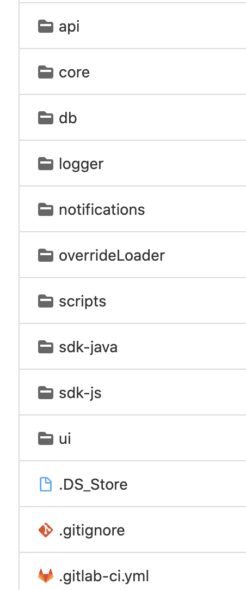
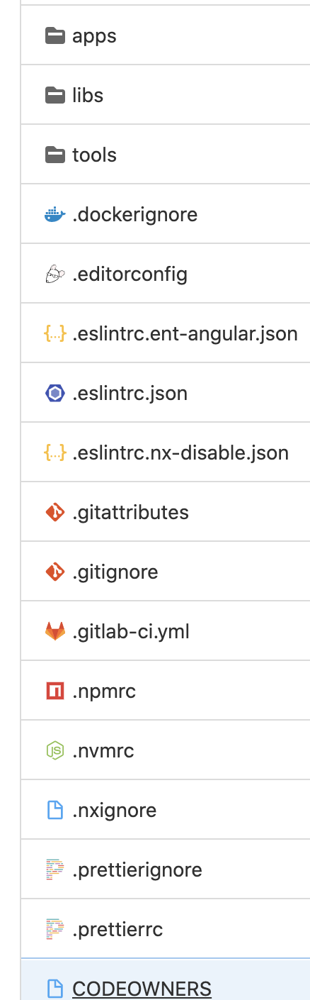

# VERACODE SCAN JOB in CI/CD

## Documentation: [PDE_Veracode](https://docs.spectrumtoolbox.com/security/)

# Reference: [Veracode](https://help.veracode.com/home)

## NOTE: veracode scan job could take up to 4 hours to finish
## New update: if you want the PDE veracode script notifies your department(DL), set up environment variables like the following:
```
> VERACODE_TO_DL_EMAIL = <DL-EXAMPLE.COM>
> VERACODE_CHECK_INTERVAL = <HOW_OFTEN_YOU_WANT_VERACODE_TO_CHECK_YOUR_APP_DONE_SCANNING_IN_SECOND>
```
## New update: if your project is Python, please includes Pipfile.lock in your root directory if you want to see Software Composition Analysis (SCA)

## Prerequisite:
There are a few different types of repo. Single app and mono repo

### Single app repo
Put the following variables in your CI/CD environment variables
```
VERACODE_TYPE = <Look the following>
> VERACODE_TYPE format is <Language>_<Language_version>_<Framework>_<Framework_version>_<package_manager>
> Example for nodejs: NODEJS_12_REACT_16_NPM
> Example for Java: JAVA_1.8_SPRINGBOOT_2.4_MAVEN
> Example for Python: PYTHON_3.5_FLASK_1.0.2_PIP
>
VERACODE_APP_NAME = <Scroll all the way down>
> If you don't have **VERACODE_APP_NAME**, it will give you error.
> Please scroll down to bottom and find your project VERACODE_APP_NAME
```

### Mono repo (overall/waterfall)
#### - waterfall type of mono repo layout example


As you can see the picture above, each folder is different programming language (JavaScript, Java, Python...etc).
If this is your mono repo setup, please set the following Environment variables:
```
> VERACODE_APP_NAME = Distillery
Note: On veracode website, this repo all start with prefix `Distillery` such as Distillery-Api, Distillery-Core ...etc
> VERACODE_MONO_REPO_TYPE = waterfall
> VERACODE_MULTI_APPS_NAMES = <APP1>_<APP2>_<APP3>...
Note: Please use underscore to separate each app. Example: api_core_db_logger_notifications_overrideLoader_sdk-java_sdk-js_ui
> VERACODE_MULTI_APPS_VERSION = <Language>_<Language_version>_<Framework>_<Framework_version>_<package_manager>, <Language>_<Language_version>_<Framework>_<Framework_version>_<package_manager> ...etc
Note: each app's version with framework (or not) should be same indexed with your app. In the example this case, api -> NODEJS_14_EXPRESS_4.17.1_YARN and core -> NODEJS_10_YARN ...etc
Example: NODEJS_14_EXPRESS_4.17.1_YARN,NODEJS_10_YARN,NODEJS_12.16.2_EXPRESS_4.17.1_NPM,NODEJS_12.16.2_NPM,NODEJS_14_YARN,PYTHON_3.8_PIP,JAVA_1.8_MAVEN,NODEJS_10_YARN,NODEJS_10.15.2_REACT_16.13_YARN
> VARACODE_CAPTIALIZED_FIRST_LETTER -> true
Note: In this case, each app name's first letter on veracode website is captalized, so set this to true
```
For waterfall mono repo, PDE veracode script will go into each app(folder), build and package, and then send to veracode


#### - overall type of mono repo layout example


As you can see the picture above, build entire repo will cover up each app (inside apps folder)
If this is your mono repo setup, please set the following Environment variables:
```
> VERACODE_MONO_REPO_ENTRY = apps
Note: In this example, the entry point for PDE veracode script to package each app
> VERACODE_MONO_REPO_SAME_LANGUAGE = true
Note: In this example, the entire project is using Nodejs for each application
> VERACODE_MONO_REPO_TYPE = overall
> VERACODE_MULTI_APPS_NAMES = <APP1>_<APP2>_<APP3>...
> VERACODE_TYPE = NODEJS_12_ANGULAR_10.2.4_YARN

> Example of file structure
> project
    - apps
      - a
      - b
      - c
```
For overall mono repo, PDE veracode script will go into each app(folder), package the index app excluding others (move to /tmp), and then send to veracode. And then delete the sending foler, move others back, and do the next index

### Summary
Veracode scan job is built by Bash and python3.
The Veracode scan will look for **veracode.sh** under your project in root directory. If the program cannot find it,
it will try to find package of **veracode** file (.zip/.war/.jar ...etc) and send to veracode. If all cannot be found, the program will do the basic zip for your project, and then send to veracode. <br />
The veracode scan job can be manual trigger, so you can trigger it only if you'd like.

**Note:** Each language has different way to package your project, please refer the link: [Veracode Packaging](https://help.veracode.com/r/c_comp_quickref)

### Generally, put the following job desciption in your gitlab-ci.yaml basic setup
```
stages:
  - scan
security:
  image: docker-artifactory.spectrumflow.net/docker/pde-veracode:latest
  stage: scan
  timeout: 4h
  tags:
    - docker
  script:
    - pde_veracode
```

## Notes: PDE veracode script has default veracode credentials, but some applications use different veracode credentials.
### If you know the veracode credentials for your application, please set up Gitlab CI/CD variables and do the following format in your gitlab-ci.yaml
CI/CD variables
```
VERACODE_ID=xxxxxxxxxxxx...
VERACODE_KEY=xxxxxxxxxxxxxxxxxxxxxxxxxxxxxxxxxxxxxxxxxxxxxxxx...
```

gitlab-ci.yaml
```
stages:
  - scan
security:
  image: docker-artifactory.spectrumflow.net/docker/pde-veracode:latest
  stage: scan
  timeout: 4h
  tags:
    - docker
  variables:
    VERACODE_ID: ${VERACODE_ID}
    VERACODE_KEY: ${VERACODE_KEY}
  script:
    - pde_veracode
```

## Contact and Q/A:
1. If you want to add new application in veracode, please reach out Sumalya Guha : Sumalya.Guha@charter.com
3. If you need access to reports, please reach out Sumalyz Guha : Sumalya.Guha@charter.com

Note: Only one scan at a time, use veracode for stage or release cadidate only (not for development or feature branches)


If you have more questions, please reach out
- c-chenhao.cheng@charter.com

#### References: The following are VERACODE_APP_NAME corresponding to your project
Enterprise projects
- SpectrumEnterprise-managed-network-edge-domain-service
- SpectrumEnterprise-paybill-domain-service
- SpectrumEnterprise-customer-info-alias-domain-service
- SpectrumEnterprise-account-domain-service
- SpectrumEnterprise-identity-domain-service
- SpectrumEnterprise-acct-stmt-listener-domain-service
- SpectrumEnterprise-voice-domain-service
- SpectrumEnterprise-reporting-domain-service
- SpectrumEnterprise-contacts-domain-service
- SpectrumEnterprise-business-intelligence-domain-service
- SpectrumEnterprise-identity-management-domain-service
- SpectrumEnterprise-event-trigger-domain-service
- SpectrumEnterprise-audit-log-event-handler
- SpectrumEnterprise-alias-domain-service
- SpectrumEnterprise-billing-domain-service
- SpectrumEnterprise-voiceserver-domain-service
- SpectrumEnterprise-queue-orchestrator-domain-service
- SpectrumEnterprise-metrics-domain-service
- SpectrumEnterprise-login-domain-service
- SpectrumEnterprise-wireless-domain-service
- SpectrumEnterprise-ticket-domain-service
- SpectrumEnterprise-storage-domain-service
- SpectrumEnterprise-password-reset-domain-service
- SpectrumEnterprise-inventory-domain-service
- SpectrumEnterprise-billing-statement-qw-domain-service
- SpectrumEnterprise-audit-domain-service
- SpectrumEnterprise-enterprise

Telescope/Specturm Access
- Telescope Server
- Telescope-ui
- Agency-graphql-server
- Sge-ui-react
- Sge-server
- Spectrum Access Server

Raven
- Raven Push Notifications Service
- Raven Regionalization Service
- Raven Weather Microservice
- Raven 1.0 Monolith
- Raven WES Ingest
- Raven Consortium Ingest
- Raven CA SoS Ingest
- Raven Weather Alerts - WX
- Raven Closings Portal

Toolds
- Cloudsearch

NSC
- creative-instake

dynamic-experience
- Distillery-Activation-Event-Loader
- Distillery-Api
- Distillery-Core
- Distillery-Db
- Distillery-Logger
- Distillery-Notifications
- Distillery-OverrideLoader
- Distillery-Sdk-Java
- Distillery-Sdk-Js
- Distillery-Ui

IDM:
- Identity Microsite

#### *** MISSING VERACODE SCANS ***
- Solution Pricing Tool
- Solution Mapping Tool
- Spectrum On Demand
- Mobile Onboarding
- Subscriber Focus
- Spectrum Access Admin
- Spectrum Access Content Library
- Agency Site
- Spectrum Originals
- CIA Validation Tool
